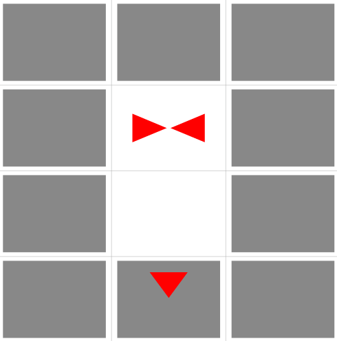
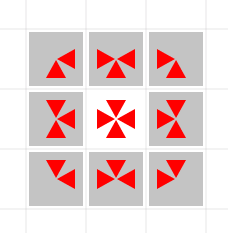
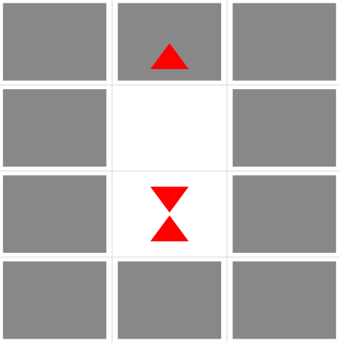
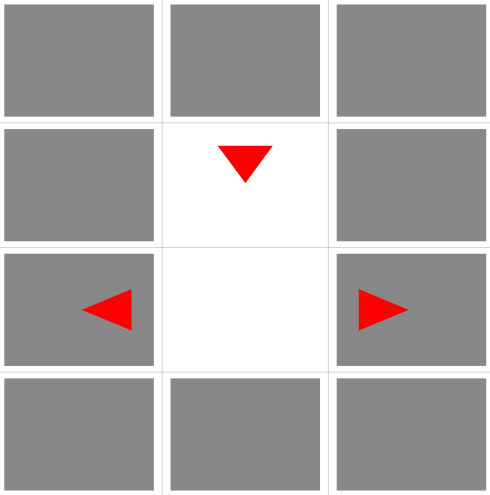

A Gas Simulation
================

*Submission to website:* Monday, February 22, 10pm

*Checkoff by LA/TA*: Tuesday, February 23, 10pm

This lab assumes you have Python 2.7 installed on your machine.  Please use the Chrome web browser.

Introduction
------------

Have you watched a film lately?
Beautifully complex simulations are everywhere: explosions, wreckage, ocean storms, sparks, and volcanoes, just to name a few.
Simulations are tremendously useful: given an initial condition and a set of rules, we can straightforwardly use a computer to evolve the initial condition according to those rules, often giving rise to vastly complex behavior, more complex than we could animate manually, or even understand analytically.

In science and engineering, simulations are often used to study high-order effects of rules such as the laws of physics. Enforcing conservation of energy in a particle model of light yields [photo-realistic images](http://renderer.ivank.net/) (slowly). Applying what little we know of hydrodynamics to 3D models lets us study [boat hulls](https://www.youtube.com/watch?v=WZwKSbI8ht8) in a variety of weather conditions.
We also use simulations to predict the weather, crime, outcomes of sports matches, and nearly everything else one could quantify.
These simulations are often computationally complex, requiring a deep understanding of numeric precision and make simplifying assumptions grounded in mathematics.

Early forms of simulation, [cellular automata](http://mathworld.wolfram.com/CellularAutomaton.html), sidestepped issues of precision and exponential complexity by discretizing (treating as integer values) time, space, motion, and anything else playing a role in the simulation. Perhaps the most well known of these cellular automaton simulations is [Conway's game of life](http://pmav.eu/stuff/javascript-game-of-life-v3.1.1/), which uses only two trivial rules to govern "life" in a square grid.

In this lab, you will implement a surprisingly capable cellular automaton simulation of a two-dimensional gas represented by an [upright square lattice](https://en.wikipedia.org/wiki/Square_lattice), inspired by the [PhD work](http://pages.cs.wisc.edu/~wylie/doc/PhD_thesis.pdf) of Brian Wylie in the late 80s. In this simple 2-dimensional world, time is partitioned into discrete "steps", gas particles occupy discrete locations within the lattice, traveling at unit speeds in exactly one of the four directions: up, left, down, or right. While the real world is of course much more complex, this very simple universe is quite sufficient to give rise to some interesting and complex behavior. In fact, simulations very much like this one were used to simulate early rocket propulsion systems.

The 6.S04 representation of a gas
---------------------------------

Much like the images from Lab 2, our gases are conceptually a 2-dimensional array in [row-major order](https://en.wikipedia.org/wiki/Row-major_order), where each cell ("pixels" of Lab 2) is a *set* (though we use a list of unique elements for simplicity in this lab) of features, which may be a wall or one of four moving particles:

* `"w"` denotes that a wall is present
* `"u"` denotes a particle moving *up*
* `"r"` denotes a particle moving *right*
* `"d"` denotes a particle moving *down*
* `"l"` denotes a particle moving *left*

No two particles moving in the same direction may occupy the same cell. Each cell in the gas is any subset of the above elements, represented as a list in arbitrary order. For example, a wall with a right-moving particle crashing into it may be represented as a `["r", "w"]`, or as `["w", "r"]` (The *Simulation Step* section below details why this particle is crashing into the wall instead of moving away to the right from it).

Much like the images of Lab 2, the top left corner of a 6.S04 gas is the origin (the 0th element in the `state` array). Some examples:

an empty 3x4 gas with no walls or particles:

    gas_1 = { width: 3,
              height: 4,
              state:  [ [], [], [],
                        [], [], [],
                        [], [], [],
                        [], [], [] ] }

Now let's surround the grid with walls on all sides.

    gas_2 = { width: 3,
              height: 4,
              state:    [ ["w"], ["w"], ["w"],
                          ["w"], [   ], ["w"],
                          ["w"], [   ], ["w"],
                          ["w"], ["w"], ["w"] ] }

Finally, add two particles in the middle, crashing into each other from the right and left.
We also add a particle crashing downwards into the bottom wall.

    gas_3 = { width: 3,
              height: 4,
              state:  [ ["w"],   ["w"],   ["w"],
                        ["w"], ["r","l"], ["w"],
                        ["w"],   [   ],   ["w"],
                        ["w"], ["w","d"], ["w"] ] }

The `server.py` visualization would show `gas_3` (a minimal gas) like this:

A "full" gas would be represented in json as:

    { "width": 5,
      "height": 5,
      "state": [ [],[], [], [], [],
                 [],["u","l","w"],["r","u","l","w"],["r","u","w"],[],
                 [],["u","l","w","d"],["r","u","d","l"],["r","u","d","w"],[],
                 [],["l","w","d"],["r","d","w","l"],["r","d","w"],[],
                 [],[], [], [], [] ] }

And would be rendered on the server as:

Simulation step
---------------

A single function `step(gas)` produces a **gas** according to the rules in this document. To compute the new gas state from the input, two steps are performed:

1. Resolve any collisions with walls.
1. Resolve any collisions among particles.
2. Advance particles according to their directions of motion.

The steps are described in detail below.

Particle collisions
-------------------

When colliding with a wall, a particle simply reverses direction.
For example, `["r","w"]` becomes `["l","w"]`. Likewise, `["u","w"]` becomes `["d","w"]`, and `["d","l","w"]` becomes `["u","r","w"]`.

Collisions between particles are more interesting. In order to preserve momentum, particles must rebound in opposing directions, but the simulation wouldn't be very interesting if the particles simply reversed their directions (indeed, the vertical and horizontal-moving particles would not interact at all). To give rise to some interesting complexity, we rotate head-on collisions by 90 degrees.

The particle collision rule is therefore exactly the following:
`["r","l"]` results in `["u","d"]`. Similarly, `["u","d"]` produces `["l","r"]`.
No other collision rules are defined in our 6.S04 gas.

What does `["u","d","l","r"]` produce after a collision?
There is no magic here, it does not match either of the collision rules, so
it remains unchanged, `["u","d","l","r"]`, the same set as the input, and correctly preserves momentum.
Three-particle interactions are straightforward also: `["l","r","u"]` does not match either collision rule, and produces `["l","r","u"]`, again unchanged, again correctly preserving momentum.

From the example above, `gas_3` would produce the following intermediate state after a collision (before propagation):

    ["w"],   ["w"],   ["w"]
    ["w"], ["u","d"], ["w"]
    ["w"],   [   ],   ["w"]
    ["w"], ["w","u"], ["w"]

Particle propagation
--------------------

This step is simple. All collisions have already been resolved, so each particle in the gas unconditionally moves one cell in its appropriate direction,

Again, from the example above, `step(gas_3)`, would produce:

    step(gas_3) = {
              width: 3,
              height: 4,
              state:  [ ["w"], ["w","u"], ["w"],
                        ["w"],    [ ],    ["w"],
                        ["w"], ["d","u"], ["w"],
                        ["w"],   ["w"],   ["w"] ] }

The next step would produce

    step(step(gas_3)) = {
              width: 3,
              height: 4,
              state:  [ ["w"],    ["w"],    ["w"],
                        ["w"],    ["d"],    ["w"],
                        ["w","l"], [ ], ["w","r"],
                        ["w"],    ["w"],    ["w"] ] }

Note: particles that move outside the bounds of the gas are forever lost.

`lab.py`
---------

This file is yours to edit in order to complete this lab. You are not expected to read or write any other code provided as part of this lab. In `lab.py`, you will find the interface your solution should support: please correctly implement the method `step` according to this document in order to earn full credit.

Your code will be loaded into a small server (`server.py`, much the same as in every other lab so far) and will serve up a visualization website, which we recommend to visually debug your simulation. To use the visualization, run `server.py` and use your web browser to navigate to [localhost:8000](http:://localhost:8000). You will need to restart `server.py` in order to re-load your code if you make changes. If you find yourself stuck, **create your own test cases to aid your debugging process**.

Testing your code
-----------------

Once your `step` outputs a valid 6.S04 gas, you can visualize the output with `server.py` to help you debug your code. The web UI uses all `.gas` gases in `./cases/` in our special 6.S04 `.gas` format (it's JSON, much like the images and test cases in the image processing lab).
You can generate your own with our handy gas generator:
`./create_gas.py --help`. Our web UI will list them alongside the ones we provide!

The visualization shows an animation of gas states produced by your `step`. For gases smaller than `16x16`, the visualization shows each particle in the gas container individually, but larger gasses are shown a *density vector field*, partitioning the simulation into `16x16` *windows*, and coloring each proportional to the ratio of particles to empty space. This simulation also shows a direction of motion for the average direction of particles in each window. Suddenly, this looks like science!

There are two ways to run the simulation:

* Press the "step" button.  This advances the simulation by one step.
* Press the "run" button (the one with the triangle on it).  This "plays" the simulation freely.  To stop it running, press the "pause" button.

To load a different gas, pause the simulation. Click on the "..." button above the gas visualization.
A list of gases will pop up, please click on the one you want to run next.

Use the `test.py` script to help you **verify** the correctness of your code. You can select which tests run like this: `test.py 1 3 7` runs only tests # 1, 3, and 7. We will only use the provided test cases to auto-grade your work. You may also wish to investigate the Python debugger (PDB) to help you find bugs efficiently.

Does your lab work? Do all tests in `test.py` pass? You're done! Submit your `lab.py` on funprog, and get your lab checked off by a friendly staff member. Consider tackling the bonus section below.

Bonus
-----

- What happens when you mess with the collision and propagation rules? Add a small, random chance for particles to spontaneously turn if they are not at a wall. How does varying this chance affect the behavior of the gas?

- Something a little tougher:

- Can you think of how you can do the simulation *in place*? That is, do not create a new state structure, but modify the existing one for *both* collisions and propagation.

You may have noticed that our simulation falls flat in some obvious cases, most notably being completely unable to generate circular ripples.
A square lattice unfortunately does not have enough symmetries to represent something like a circular ripple, but a hexagonal lattice has many more.

The collision rules in a hexagonal gas are given on page 16 of [this thesis](http://pages.cs.wisc.edu/~wylie/doc/PhD_thesis.pdf).
The Lab 3 visualization does not know anything about hexagonal lattices, but
[this article](http://www.redblobgames.com/grids/hexagons/) shows how to embed a hexagonal lattice in a square grid, allowing you to use this lab's visualization to show off your hex gas (it will be a bit distorted, but works quite well nontheless).
This is all you need to get started. Have fun!
